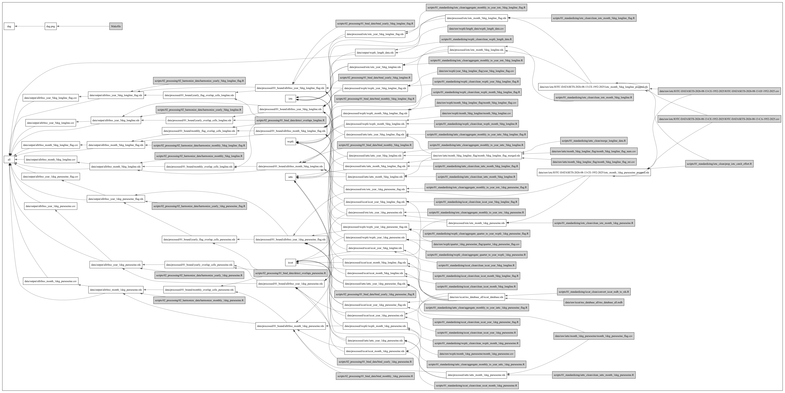

# RFMO Tuna Catch and Effort Data

## How to cite:

[](https://doi.org/10.5281/zenodo.21494710)

Emily Rodriguez & Juan Carlos Villaseñor-Derbez. (2026). RFMO Tuna Catch and Effort Data (Version v0.0.0) [Dataset]. Zenodo. https://doi.org/10.5281/zenodo.21494710


## Overview
This project develops a standardized pipeline to compile, clean, and 
restructure tuna catch and effort datasets from multiple Regional Fisheries
Management Organizations (RFMOs). 

## RFMOs Included
- **[IATTC](https://www.iattc.org/en-us/Data/Public-domain)** – Inter-American Tropical Tuna Commission data
- **[ICCAT](https://www.iccat.int/en/accesingdb.HTML)** – International Commission for the Conservation of Atlantic Tunas (task 2 data)
- **[IOTC](https://iotc.org/data/datasets)** – Indian Ocean Tuna Commission data
- **[WCPFC](https://www.wcpfc.int/public-domain-aggregated-catcheffort-data)** – Western and Central Pacific Fisheries Commission data

## Repository Structure

- `data/`:
    - `data/raw`: contains original datasets retrieved from RFMOs
    - `data/processed`: contains cleaned data from various RFMOs in a standardized format
      - `processed/01_bound`: contains bound RFMO datasets at various resolutions
    - `data/output`: contains harmonized RFMO datasets
- `scripts/`:
    - `scripts/01_standardizing`: contains scripts that clean RFMO data 
    - `scripts/02_processing`: 
      - `02_processing/01_bind_data`: contains scripts that bind RFMO data and detect overlapping cells
      - `02_processing/02_harmonize_data`: contains scripts that harmonize RFMO data
    - `scripts/03_content`:
- `results/`:
    - `results/figures`
    - `results/img`:
    - `results/tab`:

## Core design

### 1. **Standardization** (`01_standardizing`)
- **Input:** raw RFMO data files
- **Output:** RFMO-specific `.rds` file with:
  - Standardized column names
  - Standardized units
  - RFMO-specific issues resolved

### 2. **Data binding** (`02_processing/01_bind_data`)
- **Input:** cleaned RMFO datasets
- **Output:** multi-RFMO bound datasets at shared temporal/spatial resolution
  - Cell overlaps between RFMOs detected
  - RFMO identity preserved
  - All datasets must share identical variables

### 3. **Harmonization** (`02_processing/02_harmonize_data`)
- **Input:** bound datasets
- **Output:** final harmonized datasets
  - Overlapping cell data removed
  - Final datasets created

## Project Workflow

Each RFMO releases data with varying file formats, naming conventions, variables, 
and spatial resolutions. The goal of this project is to convert those source datasets
into a consistent format while preserving the original RFMO information. This repository 
implements a reproducible pipeline that transforms raw tuna catch and effort data 
from multiple RFMOs into standardized, harmonized datasets with a common structure. 

The workflow consists of three stages. **Standardization** converts raw data provided
from each RFMO into the project's standardized format, resolving any RFMO-specific formatting
differences. **Data Binding** then merges standardized datasets that share the same 
spatial and temporal resolution into a single multi-RFMO dataset while preserving the 
identity of each RFMO and identifying cells where multiple RFMOs report the same location
and time period. Finally, **harmonization** resolves those overlapping records according 
to a set of rules, producing a single harmonized dataset that contains one record per spatial
and temporal cell. 

# Developer guide for future contributors

## Adding new RFMO data

### 1. Download data from official RFMO sources
- **IATTC:** https://www.iattc.org/en-us/Data/Public-domain
- **ICCAT:** https://www.iccat.int/en/accesingdb.HTML
- **WCPFC:** https://www.wcpfc.int/sustainability/scientific-data/wcpfc-public-domain-aggregated-catcheffort-data-download-page


### 2. Store raw data under appropriate folder

- All raw data must be stored under:
 
  `data/raw/<rfmo>/` 
  
- Within each RFMO folder, the raw data should be organized using the following format:
  
  `data/raw/<rfmo>/<temporal_resolution>_<spatial_resolution>_<gear>_<aggregation>/`
  
**Where:**

- **temporal** = temporal resolution (e.g., `month`, `year`)
- **spatial** = spatial resolution (e.g., `1deg`, `5deg`)
- **gear** = fishing gear type (e.g., `purseseine`, `longline`)
- **aggregation_level** = unit of organization (e.g., `flag`, `set_type`)
  
**Example:**

- `data/raw/iattc/1deg_purseseine_flag/`
- `data/raw/wcpfc/5deg_longline_flag/`
  
*If multiple options exist for any variable above, replace with **`multi`***

### 3. Rename the raw data file
- The raw data file name should be named using the following hierarchy:
  `<temporal_resolution>_<spatial_resolution>_<gear>_<aggregation>.<file_type>`
  
### 4. Store any metadata files within the same folder as the corresponding data
- Do not rename metadata files.

### 5. Ensure downloaded data matches specified type online
- Check that the specified spatial and temporal organization, gear type, and any
other organization parameters match the downloaded file from the data source.

## Replacing existing raw RFMO data

1. Remove existing raw data and metadata.
2. Ensure downloaded raw data is properly renamed.
3. If changes have been made to the data (file type, resolutions, etc.), ensure
file name and any corresponding scripts in `01_standardizing` are updated to handle new data framework.

## Data standards

All cleaned datasets must use the following standardized variables

### Standardized variables

| Variables        | Description                                       |
|------------------|---------------------------------------------------|
| `rfmo`           | Related RFMO                                      |
| `flag`           | Flag code in ISO 3166-1 alpha-3 (excluding `SUN`) |
| `lon`            | Longitude of fishing activity                     |
| `lat`            | Latitude of the fishing activity                  |
| `year`           | Year of record                                    |
| `month`          | Month of record                                   |
| `effort_set`     | Number of fishing sets                            |
| `effort_day`     | Number of fishing days                            |
| `effort_t_hooks` | Thousands of hooks                                |
| `catch_tot`      | Total catch (mt)                                  |
| `catch_skj`      | Catch of skipjack tuna (mt)                       |
| `catch_alb`      | Catch of albacore tuna (mt)                       |
| `catch_bet`      | Catch of bigeye tuna (mt)                         |
| `catch_yft`      | Catch of yellowfin tuna (mt)                      |

## Additional variables specific to length datasets

| Variables    | Description                                                  |
|--------------|--------------------------------------------------------------|
| `tstrat`     | Temporal stratification                                      |
| `gear`       | Gear type                                                    |
| `species`    | Tuna species                                                 |
| `length_cm`  | Fish length in centimeters                                   |
| `length_bin` | Length class/bin in cm based on interval (e.g., 1,2 cm bins) |

### General rules
- Use snake_case for all variable names
- Missing values should be stored as `NA`, not `0`
- Variables unavailable in a dataset should be included and filled with `NA`
- `catch_tot` should be computed from selected species catch values
- Flag codes should be in ISO 3166-1 alpha-3
- Remove variables where all species-specific catch variables are either `NA` or `0`.

## Standardizing raw data

All standardizing scripts should be stored under `scripts/01_standardizing/<rfmo>_clean/`.

### 1. Creating a cleaning script

- Use the following naming convention:
`clean_<rfmo>_<temporal resolution>_<spatial resolution>_<gear type>_<aggregation>.R`

**Example:**

`clean_iattc_month_1deg_flag.R`

### 2. Load and clean the raw data

**Each cleaning script should:**

- Load the raw RFMO dataset.
- Rename RFMO-specific variables to the project's standard variable names.
- Create any required placeholder columns if the RFMO does not report them (e.g., `effort_day`).
- Center `lat` and `lon` variables if needed.
- Calculate `catch_tot` as the sum of selected species catch columns.
- Remove observations where all species catches are missing or all are zero.
- Keep only standardized columns and their required order.

### 3. Save the cleaned dataset

- Write the cleaned data as a `.rds` file to the appropriate directory under 
`data/processed/<rfmo>`, using the following file name framework:

`<rfmo>_<temporal_resolution>_<spatial_resolution>_<aggregation>.rds`

**Example:**

`data/processed/iattc/iattc_month_1deg_purseseine.rds`

#### **RFMO specific notes** *(for current workflow)*:

- ICCAT raw data must first be converted from `.mdb` to `.rds`.
- ICCAT and WCPFC `lat` and `lon` variables must both be centered.
- ICCAT `lat` and `lon` are reported for the corner of the cell nearest 0°/0°, with
  `quad_id` carrying the hemisphere. The offset must therefore be applied *before* the
  sign (`lat_sign * (lat + offset)`), so cells are centered away from the equator and
  Greenwich, and the offset must be `2.5` for the 5°×5° longline data.
- WCPFC effort in hooks needs to be converted to thousands of hooks (`effort_t_hooks`).
- IOTC raw data is delivered as two long-format files, catch (`CA`) and effort (`EF`),
  which must be joined. `scripts/01_standardizing/iotc_clean/prep_iotc_catch_effort.R`
  reads both once and writes compact intermediates under `data/raw/iotc/`; the seven
  cleaning scripts read those intermediates rather than the raw CSVs.

##### IOTC specific notes

- **Cells.** `FISHING_GROUND_CODE` is a CWP grid code, `[size][quadrant][lat 2][lon 3]`.
  Size `5` is 1°×1° and size `6` is 5°×5°. As with ICCAT, the offset is applied before
  the sign so cells are centered away from 0°/0°. Purse seine is reported at 1°×1° and
  longline at 5°×5°, matching the resolutions used elsewhere in the project.

- **Skipjack in longline data.** IOTC reports skipjack in its longline data, but IATTC,
  ICCAT and WCPFC do not. `catch_skj` is dropped from the IOTC longline datasets so that
  all longline datasets share identical variables. Skipjack is retained in the purse
  seine datasets.

- **Multi-month records.** 3,631 raw records span more than one month
  (`MONTH_START != MONTH_END`), mostly longline strata reported as January–December
  annual totals. These are dropped, mirroring the ICCAT `time_period_id < 13` filter, so
  that the yearly datasets remain a straight aggregation of the monthly ones.

- **Catch–effort join keys.** Catch and effort are stratified differently and are joined
  on different keys by gear:
  - *Longline* — school type is `UNCL` in both files and fishery and gear codes
    correspond exactly, so the full stratum key is used.
  - *Purse seine* — effort is largely reported undifferentiated (`PSOT`/`UNCL`) while
    catch is split by school type (`PSLS`/`LS`, `PSFS`/`FS`). `FISHERY_CODE` and school
    type are therefore dropped from the key. Joining on the full key would leave ~68% of
    catch records with no effort, which is an artifact rather than missing data.

- **Purse seine effort units.** IOTC reports purse seine effort in several units. Only
  those matching the rest of the project are used: `SETS` becomes `effort_set` and
  `FDAYS` (fishing days) becomes `effort_day`. `FHOURS`, `HOURS`, `STDHR`, `TRIPS` and
  `DAYS` (days at sea) are not comparable and are left as `NA`. All catch records are
  retained regardless.

  | Units reported on the stratum | Catch records | Catch (mt) | Years | Effort retained |
  |-------------------------------|---------------|------------|-------------|-----------------|
  | `SETS`                        | 84,800 (19.7%)  | 2,425,454 (18.5%) | 2009–2025 | `effort_set` |
  | `FDAYS`                       | 60,843 (14.1%)  | 1,681,839 (12.8%) | 1984–2025 | `effort_day` |
  | `SETS` and `FDAYS`            | 2,207 (0.5%)    | 57,082 (0.4%)     | 2024–2025 | both |
  | `FHOURS`, `HOURS`, `STDHR`    | 168,283 (39.1%) | 5,906,479 (45.1%) | 1981–2017 | none |
  | `FHOURS`, `HOURS`             | 45,016 (10.5%)  | 1,660,094 (12.7%) | 1983–2000 | none |
  | `FHOURS`                      | 42,518 (9.9%)   | 1,104,520 (8.4%)  | 1988–2020 | none |
  | `DAYS`                        | 20,198 (4.7%)   | 240,161 (1.8%)    | 1985–2017 | none |
  | `TRIPS`                       | 6,359 (1.5%)    | 31,208 (0.2%)     | 2014–2024 | none |

  **Roughly two thirds of IOTC purse seine catch, almost all of it before 2009, therefore
  has no effort reported.** Catch coverage is complete, but effort-based quantities such
  as CPUE should not be computed from IOTC purse seine data for the earlier period.
  `effort_set` is `NA` for 100% of pre-2009 records.

- **Flag codes.** IOTC fleet codes are mostly ISO 3166-1 alpha-3 already. The exceptions
  are mapped as follows:

  | IOTC fleet code | `flag` | Reason |
  |-----------------|--------|--------|
  | `EUESP`, `EUFRA`, `EUPRT`, `EUITA`, `EUMYT` | `ESP`, `FRA`, `PRT`, `ITA`, `MYT` | EU member fleets, `EU` prefix removed |
  | `GBRT` | `GBR` | UK territories fleet |
  | `EUREU` | `NA` | Generic EU code, not a country |
  | `NEIPS`, `NEIFR`, `NEISU`, `NEICE` | `NA` | Not elsewhere included, not a country |

- **Missing values when aggregating.** `sum(x, na.rm = TRUE)` returns `0` when every
  value in a group is missing, which would record "not reported" as "zero". Because large
  stretches of IOTC purse seine effort are not reported, the IOTC scripts aggregate with
  a `sum_or_na()` helper that returns `NA` for all-missing groups, consistent with the
  general rule that missing values are stored as `NA`, not `0`.

#### **Aggregating data to a specific resolution if it is not available**

In the case that a specific dataset does not exist for the final harmonized set 
(ex.: WCPFC missing a yearly flag dataset), aggregate the nearest dataset to the
required resolution, and name as follows:

`aggregate_<original_resolution>_to_<new_resolution>_<rfmo>_<spatial_resolution>_<gear>_<aggregation>.R`

## Binding data

Binding scripts should be stored under `02_processing/01_bind_data`

### 1. Create script for the specified resolution
- All scripts should be named using the following format:

`bind_<temporal_resolution>_<spatial_resolution>_<gear_type>_<aggregation>.R`

### 2. Load in corresponding datasets
- Datasets must all be under the same temporal and spatial resolution, as well as aggregation (e.g. flag/no flag).

### 3. Bind datasets
- Use `bind_rows` to combine datasets.
- Arrange by temporal resolution and aggregation if applicable.

### 4. Export bound dataset to `data/processed/01_bound/`
- Use the following format for the bound file name:

`allrfmo_<temporal_resolution>_<spatial_resolution>_<gear_type>_<aggregation>.rds`

## Detecting overlaps
Once datasets are bound, overlaps between RFMOs (where two or more RFMOs report data for
the same cell at the same time) must be detected. Overlap detection scripts should
be stored in `02_processing/01_bind_data`.

### 1. Load bound data into appropriate script
There is a script for each gear type, one for longline and one for purse seine (`detect_overlaps_longline`
and `detect_overlaps_purseseine`).

- Load all corresponding datasets based on gear type.
- Organize datasets by temporal resolution to make the workflow easier to follow.

### 2. Filter to RFMOs that require overlap detection
- Overlap detection covers all RFMOs in the bound dataset. If a future workflow needs to
  restrict it to a subset, filter each dataset to the RFMOs that share an overlap
  boundary before detecting cells.

### 3. Detect overlapping cells
- For each dataset, group observations by the spatial and temporal identifiers and identify
cells that are reported by both RFMOs.

- **Yearly data:** group by `lat`, `lon`, and `year`.
- **Monthly data:** group by `lat`, `lon`, `year`, and `month`.
- Filter groups where `n_distinct(rfmo) >= 2`, indicating that more than one RFMO reports
  data for the same cell and time period.
  
  
### 4. Export overlap-cell datasets
- Reduce each overlap dataset to the unique spatial and temporal identifiers using
  `distinct()`.
- Export each overlap dataset as an `.rds` file to `data/processed/01_bound/`.
- Save separate files for spatial and temporal resolutions, as well as aggregation if applicable.
- Final names should use the following format and be stored under `data/processed/01_bound/`:

`<temporal_resolution>_<aggregation>_overlap_cells_<gear_type>.rds`

**Example:**
`yearly_flag_overlap_cells_purseseine.rds`

## Harmonizing Data

After overlap cells have been identified, overlapping records must be harmonized so that only one RFMO record is retained for each spatial and temporal cell. 
Harmonization scripts should be stored in `02_processing/02_harmonize_data`.

### 1. Load data
- Load the bound RFMO dataset.
- Load the corresponding overlap-cell dataset generated during the overlap detection step.
- The overlap-cell dataset identifies the latitude, longitude, year, and month combinations that have multiple reportings.

### 2. Identify overlapping cells
- Join the overlap-cell dataset to the bound dataset using the spatial and temporal identifiers (`lat`, `lon`, `year`, and `month`).
- Create an `overlap` indicator to distinguish cells requiring harmonization from those with no overlap.

### 3. Compare overlapping records
Within each overlapping cell:

- Group observations by `lat`, `lon`, `year`, and `month`.
- Calculate the maximum reported catch (`catch_tot`) and maximum reported effort (`effort_set`) for each group.
- These values are used to determine which RFMO record should be retained.

### 4. Apply harmonization rules
Records are retained according to the following hierarchy:

1. Retain all records that do not occur in overlap cells.
2. For overlap cells, retain the record with the highest reported total catch (`catch_tot`).
3. If catch is unavailable for all records in the cell, retain the record with the highest reported effort (`effort_set`).
4. If multiple records remain after these comparisons, retain the record from the
   highest priority RFMO. The priority order is `wcpfc` > `iattc` > `iotc` > `iccat`,
   defined as `rfmo_priority` at the top of each harmonizing script.

### 5. Remove temporary variables
- Remove the temporary columns created during the harmonization process (e.g., `overlap`, `max_catch`, and `max_effort`).
- Return the dataset to its original structure.

### 6. Export the harmonized dataset
- Save the harmonized dataset as an `.rds` file in `data/output/`.
- This exported dataset represents a final harmonized dataset.
- The file should be named using the following structure:

`allrfmo_<temporal_resolution>_<spatial_resolution>_<gear_type>_<aggregation>.rds`

## Additional data versions

`.csv` files are also available for all harmonized datasets in `data/output/`. These
.`csv` files are not created within the harmonizing R scripts. Instead, `.csv` files 
are created in the `Makefile`. See Makefile section for instructions.

# Cleaning length data

Length data is currently available from the WCPFC and is included as a supplementary dataset, 
processed separately from catch and effort data.

The raw data is stored under `data/raw/wcpfc/length_data/`.

The script to clean this data is stored under `scripts/standardizing/wcpfc_clean/`.
This cleaning script should be named `clean_wcpfc_length_data.R`.

## Cleaning steps:
- Retain only tuna species used in catch and effort data.
- Retain and center the 5°×5°cells.
- Exclude 5 cm length bins, retaining only 1 cm and 2 cm bins (`lstrat = 1` or `2`).
- Retain only records using the length code `UF`.
- Rename variables to the project's standardized names.
- Expand frequency observations so each row now represents a single fish measurement.

Export the cleaned dataset as `data/output/wcpfc_length_data.rds`.

## Makefile




The Makefile should rebuild the entire pipeline from raw → processed → output. Additionally,
the Makefile creates `.csv` formats of all harmonized datasets using the following code:

```text
$(OUT)%.csv: $(OUT)%.rds
	Rscript -e "write.csv(readRDS('$<'), '$@', row.names = FALSE)"
```
`.csv` formats of the harmonized datasets are stored in `data/output/`. There is no
`.csv` file creation for the WCPFC length dataset.

### Stray blocks in the generated DAG

The Makefile visual (`dag.png`) contains stray blocks corresponding to Makefile targets
that are not expected to appear as standalone DAG nodes. These do not correspond
to the overall project workflow. The solution to suppress these blocks
has not been determined. Stray blocks include:

- `all`
- `wcpfc`
- `iattc`
- `iccat`

# Reference

## Harmonized datasets
##### File path under: [data/output](data/output)
| Gear        | Spatial | Temporal | By flag | RFMOs Included            | Dataset                                 |
|-------------|---------|----------|---------|---------------------------|-----------------------------------------|
| purse seine | 1°×1°   | month    | no      | IATTC, ICCAT, IOTC, WCPFC | `allrfmo_month_1deg_purseseine.rds`     |
| purse seine | 1°×1°   | year     | no      | IATTC, ICCAT, IOTC, WCPFC | `allrfmo_year_1deg_purseseine.rds`      |
| purse seine | 1°×1°   | year     | yes     | IATTC, ICCAT, IOTC, WCPFC | `allrfmo_year_1deg_purseseine_flag.rds` |
| longline    | 5°×5°   | month    | no      | IATTC, ICCAT, IOTC, WCPFC | `allrfmo_month_5deg_longline.rds`       |
| longline    | 5°×5°   | month    | yes     | IATTC, ICCAT, IOTC, WCPFC | `allrfmo_month_5deg_longline_flag.rds`  |
| longline    | 5°×5°   | year     | no      | IATTC, ICCAT, IOTC, WCPFC | `allrfmo_year_5deg_longline.rds`        |
| longline    | 5°×5°   | year     | yes     | IATTC, ICCAT, IOTC, WCPFC | `allrfmo_year_5deg_longline_flag.rds`   |

## Cleaned catch and effort datasets by RFMO

### IATTC
##### File path under: [data/processed/iattc](data/processed/iattc)
| Gear        | Spatial | Temporal | By flag | Dataset                               | Dataset                                 |
|-------------|---------|----------|---------|---------------------------------------|-----------------------------------------|
| purse seine | 1°×1°   | month    | no      | `iattc_month_1deg_purseseine.rds`     | `allrfmo_month_1deg_purseseine.rds`     |
| purse seine | 1°×1°   | year     | no      | `iattc_year_1deg_purseseine.rds`      | `allrfmo_year_1deg_purseseine.rds`      |
| purse seine | 1°×1°   | year     | yes     | `iattc_year_1deg_purseseine_flag.rds` | `allrfmo_year_1deg_purseseine_flag.rds` |
| longline    | 5°×5°   | month    | no      | `iattc_month_5deg_longline.rds`       | `allrfmo_month_5deg_longline.rds`       |
| longline    | 5°×5°   | month    | yes     | `iattc_month_5deg_longline_flag.rds`  | `allrfmo_month_5deg_longline_flag.rds`  |
| longline    | 5°×5°   | year     | no      | `iattc_year_5deg_longline.rds`        | `allrfmo_year_5deg_longline.rds`        |
| longline    | 5°×5°   | year     | yes     | `iattc_year_5deg_longline_flag.rds`   | `allrfmo_year_5deg_longline_flag.rds`   |

### ICCAT
##### File path under: [data/processed/iccat](data/processed/iccat)
| Gear        | Spatial | Temporal | By flag | Dataset                               |
|-------------|---------|----------|---------|---------------------------------------|
| purse seine | 1°×1°   | month    | no      | `iccat_month_1deg_purseseine.rds`     |
| purse seine | 1°×1°   | year     | no      | `iccat_year_1deg_purseseine.rds`      |
| purse seine | 1°×1°   | year     | yes     | `iccat_year_1deg_purseseine_flag.rds` |
| longline    | 5°×5°   | month    | no      | `iccat_month_5deg_longline.rds`       |
| longline    | 5°×5°   | month    | yes     | `iccat_month_5deg_longline_flag.rds`  |
| longline    | 5°×5°   | year     | no      | `iccat_year_5deg_longline.rds`        |
| longline    | 5°×5°   | year     | yes     | `iccat_year_5deg_longline_flag.rds`   |

### IOTC
##### File path under: [data/processed/iotc](data/processed/iotc)
| Gear        | Spatial | Temporal | By flag | Dataset                              |
|-------------|---------|----------|---------|--------------------------------------|
| purse seine | 1°×1°   | month    | no      | `iotc_month_1deg_purseseine.rds`     |
| purse seine | 1°×1°   | year     | no      | `iotc_year_1deg_purseseine.rds`      |
| purse seine | 1°×1°   | year     | yes     | `iotc_year_1deg_purseseine_flag.rds` |
| longline    | 5°×5°   | month    | no      | `iotc_month_5deg_longline.rds`       |
| longline    | 5°×5°   | month    | yes     | `iotc_month_5deg_longline_flag.rds`  |
| longline    | 5°×5°   | year     | no      | `iotc_year_5deg_longline.rds`        |
| longline    | 5°×5°   | year     | yes     | `iotc_year_5deg_longline_flag.rds`   |

### WCPFC
##### File path under: [data/processed/wcpfc](data/processed/wcpfc)
| Gear        | Spatial | Temporal | By flag | Dataset                                  |
|-------------|---------|----------|---------|------------------------------------------|
| purse seine | 1°×1°   | month    | no      | `wcpfc_month_1deg_purseseine.rds`        |
| purse seine | 5°×5°   | month    | no      | `wcpfc_month_5deg_purseseine.rds`        |
| purse seine | 1°×1°   | quarter  | yes     | `wcpfc_quarter_1deg_purseseine_flag.rds` |
| purse seine | 5°×5°   | quarter  | no      | `wcpfc_quarter_5deg_purseseine.rds`      |
| purse seine | 1°×1°   | year     | yes     | `wcpfc_year_1deg_purseseine_flag.rds`    |
| purse seine | 1°×1°   | year     | no      | `wcpfc_year_1deg_purseseine.rds`         |
| purse seine | 5°×5°   | year     | no      | `wcpfc_year_5deg_purseseine.rds`         |
| longline    | 5°×5°   | month    | no      | `wcpfc_month_5deg_longline.rds`          |
| longline    | 5°×5°   | month    | yes     | `wcpfc_month_5deg_longline_flag.rds`     |
| longline    | 5°×5°   | quarter  | yes     | `wcpfc_quarter_5deg_longline_flag.rds`   |
| longline    | 5°×5°   | year     | yes     | `wcpfc_year_5deg_longline_flag.rds`      |

## Raw catch and effort datasets by RFMO *(last updated January 2026)*

### IATTC
##### Source: https://www.iattc.org/en-us/Data/Public-domain
##### File path under: [data/raw/iattc](data/raw/iattc)

| Gear          | Spatial | Temporal | Organized by | Measurement type      | Species           | Base path                  | Dataset                             | Metadata                        |
|---------------|---------|----------|--------------|-----------------------|-------------------|----------------------------|-------------------------------------|---------------------------------|
| pole and line | 1°×1°   | month    | flag         | metric tons           | tuna              | `month_1deg_poleline_flag` | `month_1deg_poleline_flag.csv`      | `LPTuna-Atun.pdf`               |
| purse seine   | 1°×1°   | month    | flag         | metric tons           | tuna              | `month_1deg_purseseine`    | `month_1deg_purseseine_flag.csv`    | `PSTuna-Atun.pdf`               |
| purse seine   | 1°×1°   | month    | set type     | metric tons           | tuna              | `month_1deg_purseseine`    | `month_1deg_purseseine_settype.csv` | `PSTuna-Atun.pdf`               |
| longline      | 5°×5°   | month    | flag         | metric tons           | tuna and billfish | `month_5deg_longline_flag` | `month_5deg_longline_flag_mt.csv`   | `LLTunaBillfish-AtunPicudo.pdf` |
| longline      | 5°×5°   | month    | flag         | number of individuals | tuna and billfish | `month_5deg_longline_flag` | `month_5deg_longline_flag_num.csv`  | `LLTunaBillfish-AtunPicudo.pdf` |

### ICCAT
##### Source: https://www.iccat.int/en/accesingdb.HTML
##### File path under: [data/raw/iccat](data/raw/iccat)
##### Additional metadata can be found [here](https://www.iccat.int/en/stat_codes.html)
| Gear  | Spatial         | Temporal | Organized by            | Measurement type | Species | Base path                            | Dataset                                   | Metadata       |
|-------|-----------------|----------|-------------------------|------------------|---------|--------------------------------------|-------------------------------------------|----------------|
| multi | 1°×1° and 5°×5° | multi    | flag                    | -                | multi   | `month_multigear_flag`               | `month_multigear_flag.xlsx`               | `t2ce-ENG.pdf` |
| multi | 1°×1° and 5°×5° | multi    | flag and operation mode | -                | multi   | `month_multigear_flag_operationmode` | `month_multigear_flag_operationmode.xlsx` | `t2ce-ENG.pdf` |
| multi | 1°×1° and 5°×5° | multi    | multi                   | -                | multi   | `ms_database_all`                    | `iccat_database.rds`                      | `t2ce-ENG.pdf` |
| multi | 1°×1° and 5°×5° | multi    | multi                   | -                | multi   | `ms_database_all`                    | `ms_database_all.mdb`                     | `t2ce-ENG.pdf` |

### IOTC
##### Source: https://iotc.org/data/datasets
##### File path under: [data/raw/iotc](data/raw/iotc)

| Gear  | Spatial         | Temporal | Organized by | Measurement type      | Species | Base path                                 | Dataset                                     |
|-------|-----------------|----------|--------------|-----------------------|---------|-------------------------------------------|---------------------------------------------|
| multi | 1°×1° and 5°×5° | month    | catch        | metric tons and number of individuals | multi | `IOTC-DATASETS-2026-08-13-CE-1952-2025` | `IOTC-DATASETS-2026-08-13-CA-1952-2025.csv` |
| multi | 1°×1° and 5°×5° | month    | effort       | multiple effort units | multi   | `IOTC-DATASETS-2026-08-13-CE-1952-2025` | `IOTC-DATASETS-2026-08-13-EF-1952-2025.csv` |

Both files are long format and share the same stratum columns. Field definitions and
code lists are published alongside the download at https://iotc.org/data/datasets.

The two intermediates written by `prep_iotc_catch_effort.R`
(`iotc_month_5deg_longline_prepped.rds` and `iotc_month_1deg_purseseine_prepped.rds`)
are also stored in this folder. They are generated by the pipeline, not downloaded.

### WCPFC
##### Source: https://www.wcpfc.int/sustainability/scientific-data/wcpfc-public-domain-aggregated-catcheffort-data-download-page
##### File path under: [data/raw/wcpfc](data/raw/wcpfc)
##### Length data under: [data/raw/wcpfc/length_data](data/raw/wcpfc/length_data)

| Gear          | Spatial | Temporal | Organized by | Measurement type                      | Species  | Base path                      | Dataset                            | Metadata                  |
|---------------|---------|----------|--------------|---------------------------------------|----------|--------------------------------|------------------------------------|---------------------------|
| purse seine   | 1°×1°   | month    | -            | metric tons                           | tuna     | `month_1deg_purseseine`        | `month_1deg_purseseine.csv`        | `Purse_seine.pdf`         |
| drift net     | 5°×5°   | month    | -            | metric tons and number of individuals | albacore | `month_5deg_driftnet`          | `month_5deg_driftnet.csv`          | `GN_Public_by_YR_MON.pdf` |
| longline      | 5°×5°   | month    | -            | metric tons and number of individuals | multi    | `month_5deg_longline`          | `month_5deg_longline.csv`          | `Longline.pdf`            |
| longline      | 5°×5°   | month    | flag         | metric tons and number of individuals | multi    | `month_5deg_longline_flag`     | `month_5deg_longline_flag.csv`     | `Longline.pdf`            |
| pole and line | 5°×5°   | month    | -            | metric tons                           | multi    | `month_5deg_poleline`          | `month_5deg_poleline.csv`          | `Pole_and_line.pdf`       |
| purse seine   | 5°×5°   | month    | -            | metric tons                           | tuna     | `month_5deg_purseseine`        | `month_5deg_purseseine.csv`        | `Purse_seine.pdf`         |
| pole and line | 1°×1°   | quarter  | -            | metric tons                           | tuna     | `quarter_1deg_poleline`        | `quarter_1deg_poleline.csv`        | `Pole_and_line.pdf`       |
| purse seine   | 1°×1°   | quarter  | flag         | metric tons                           | tuna     | `quarter_1deg_purseseine_flag` | `quarter_1deg_purseseine_flag.csv` | `Purse_seine.pdf`         |
| longline      | 5°×5°   | quarter  | flag         | metric tons and number of individuals | multi    | `quarter_5deg_longline_flag`   | `quarter_5deg_longline_flag.csv`   | `Longline.pdf`            |
| purse seine   | 5°×5°   | quarter  | flag         | metric tons                           | tuna     | `quarter_5deg_purseseine_flag` | `quarter_5deg_purseseine_flag.csv` | `Purse_seine.pdf`         |
| longline      | 5°×5°   | year     | flag         | metric tons and number of individuals | multi    | `year_5deg_longline_flag`      | `year_5deg_longline_flag.csv`      | `Longline.pdf`            |
| purse seine   | 5°×5°   | year     | flag         | metric tons                           | tuna     | `year_5deg_purseseine_flag`    | `year_5deg_purseseine_flag.csv`    | `Purse_seine.pdf`         |

